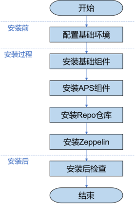
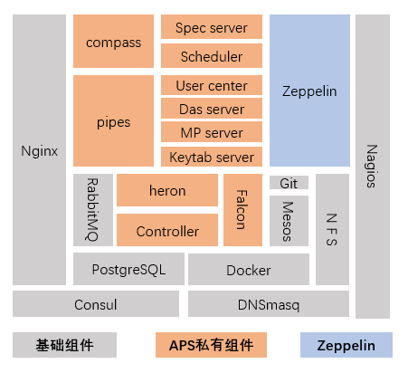

# 安装概览


本文档描述APS在自动化安装场景下的部署及实施过程。

## 安装流程

APS集群包括多种组件，采用分布式组网，APS的安装过程支持自动化部署，其安装流程如下图所示：

APS组件结构图如下所示：

## 安装规划

### 安装软件清单

本手册仅限于centos 7(1611) 64位server GUI版本系统,并在该系统下进行测试,开发等操作。安装过程使用非root用户（如可在每台主机创建aps用户）进行，且安装包使用本地yum源。基础组件的安装版本如下表所示：

| 组件名称 | 版本 |
| :--- | :--- | 
| Centos |	1611-server GUI |
| jdk	| jdk1.8.0_144 |
| docker-ce	| 17.09.0.ce-1.el7.centos |
| mesos	| 1.4.1-2.0.1 |
| rabbitmq-server |	3.3.5-34.el7 |
| consul	| 0.9.3 |
| git	| 1.8.3.1-12.el7_4 |
| postgresql93-server |	9.3.20 |
| APS组件	| 0.9 |
| zeppelin	| 0.7.3 |
| nginx	| 1.12  |
| redis	| 3.2.9 |
| keepalived |	1.3.5-1.el7 |
| Nagios |	4.3.4 |

说明:APS组件是指compass、pipes、dasserver、heron等私有组件。

### 安装规划

#### 安装用户规划

安装用户名和密码规划如下表所示：

|用户名	  |	 密码	 |  用户属组 |	   创建节点     |
| :--- | :--- | :--- | :--- |                       
|aps	  |   123456 |	aps	     |   所有           |
|apsapp   |	123456	 |   aps	 |       所有       |
|zeppelin |	zeppelin |	zeppelin |   aps02  aps03   |

#### 主机名规划和IP地址规划

|服务器序号	| 域名				| Hostname	|  IPv4地址              |
| :--- | :--- | :--- | :--- |                                        
|1			| aps01.zetyun.com	| aps01     |  请根据实际情况配置	 |
|2			| aps02.zetyun.com	| aps02	    |    请根据实际情况配置  |
|3			| aps03.zetyun.com	| aps03	    |  请根据实际情况配置    |
|4			| aps04.zetyun.com	| aps04	    | 请根据实际情况配置    |

### 软件部署规划

软件部署规划如下表所示，第一行表示安装的主机，从第二行开始每行表示一个组件及其部署主机。

|aps01			       | aps02			     |  aps03 				|    aps04            |
| :--- | :--- | :--- | :--- |                                                             
|docker-ce		       | docker-ce		     |  docker-ce			|     docker-ce       |
|dnsmasq			   | dnsmasq		 |  	    -			|		-             |
|consul(server)	       | consul(server)	     |  consul(server)		|      consul(client) |
|Zookeeper		       | Zookeeper		     |  Zookeeper	        |    -                 |
|mesos(master)	       | mesos(master)	     |  mesos(master)	    |     -                |
|mesos(slave)	       | mesos(slave)	     |  mesos(slave)        |      -               |
|git				   |     git		     |     -                 |      -               |
|-				       | rabbitmq		     |  rabbitmq	        |       -              |
|-				       | postgresql		     |  postgresql	        |      -               |
|-				       | keepalived		     |  keepalived	        |      -               |
|-				       | Zeppelin		     |  Zeppelin			|    -                |
|nagios（server\agent） |	nagios（agent）  | 		nagios（agent）	|	nagios（agent）   |
|aps					|	aps				 |  	-				|	-                 |

## 安装包列表

在安装前，请获取如下安装包：

|安装包名称	|说明|
| :--- | :--- |
|aps-deploy-*tgz	|APS安装包，包括基础组件以及APS私有组件的安装程序包以及安装脚本。|
|CRAN.tar	|R的repo源。|
|pypi.tar	|python的repo源。|

说明:安装包名称中的*表示软件版本号，请以实际情况为准。
